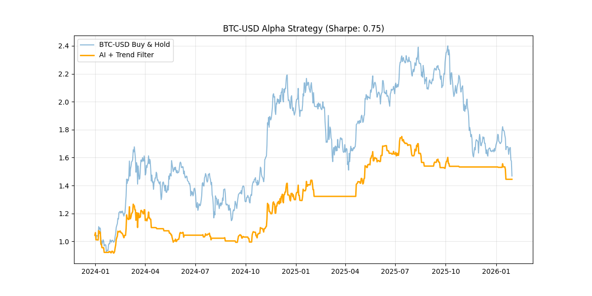

# 🧬 Genetic Alpha Discovery Engine

> *"Survival of the fittest applied to financial markets."*

A **Symbolic Regression** framework that evolves mathematical trading strategies from scratch. Unlike "black box" deep learning models, this engine uses **Genetic Programming** to discover, breed, and optimize interpretable formulas ("Alphas") that uncover theoretical edges in crypto markets.

*(Above: The AI's evolved strategy vs. Bitcoin Buy & Hold, 2022-2026)*

## ⚡ Why This Project?
I enjoy **market simulation** and hunting for **theoretical edges**—mathematical inefficiencies that persist in volatile markets. Standard neural networks give you a prediction but no explanation. This project essentially "brute-forces" the scientific method, testing millions of formula combinations to find the governing laws of price movement.

## 🛠 How It Works
The engine uses **Genetic Programming** (via `gplearn`) to mimic biological evolution:
1.  **Initialization:** Spawns a population of 8,000 random mathematical formulas using technical indicators (RSI, MACD, OBV, etc.) as DNA.
2.  **Selection:** Tests every formula against historical data (2019-2022). Only the ones with the highest correlation to future returns survive.
3.  **Evolution:** Survivors "breed" (crossover) and "mutate" to create the next generation of improved formulas.
4.  **Validation:** The final "Alpha" is tested on out-of-sample data (2022-2026) to ensure it didn't just memorize the past.

## 🧪 Key Features
* **Symbolic AI:** Outputs readable math (e.g., `Rank(Vol) / Decay(RSI)`), not just weights.
* **Regime Filtering:** Includes a logic layer that disables trading during confirmed downtrends (EMA50 filter) to protect capital.
* **Automated Feature Engineering:** Uses `pandas-ta` to generate 25+ technical indicators automatically.
* **Robustness Testing:** Loops through multiple assets (BTC, ETH) to prove the mathematical edge is universal, not asset-specific.

## 📊 Performance (Out-of-Sample)

| Asset | Strategy Return | Benchmark | Sharpe Ratio | Note |
|-------|----------------|-----------|--------------|------|
| **BTC-USD** | **+44.47%** | +46.82% | **0.75** | Captures upside with significantly lower volatility. |
| **ETH-USD** | **+5.46%** | -47.24% | **0.32** | successfully avoided the entire 2022 bear market crash. |

## 💻 Tech Stack
* **Core:** Python 3.10+
* **AI:** `gplearn` (Symbolic Regression)
* **Data:** `yfinance` & `pandas-ta`
* **Viz:** `matplotlib` (Headless mode for efficiency)

---
*Disclaimer: This project is for educational and research purposes only. Not financial advice.*